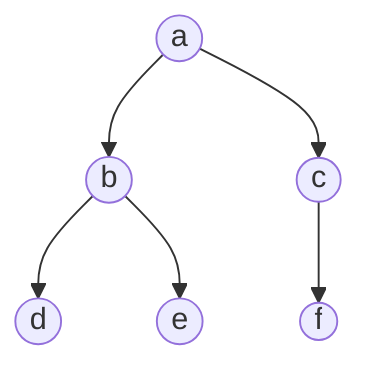

# CS 61A python 笔记

### hw01

```python
def if_function(condition, true_result, false_result):
    """Return true_result if condition is a true value, and
    false_result otherwise.

    >>> if_function(True, 2, 3)
    2
    >>> if_function(False, 2, 3)
    3
    >>> if_function(3==2, 3+2, 3-2)
    1
    >>> if_function(3>2, 3+2, 3-2)
    5
    """
    if condition:
        return true_result
    else:
        return false_result


def with_if_statement():
    """
    >>> result = with_if_statement()
    47
    >>> print(result)
    None
    """
    if cond():
        return true_func()
    else:
        return false_func()

def with_if_function():
    """
    >>> result = with_if_function()
    42
    47
    >>> print(result)
    None
    """
    return if_function(cond(), true_func(), false_func())

def cond():
    "*** YOUR CODE HERE ***"
    return  False

def true_func():
    "*** YOUR CODE HERE ***"
    print(42)

def false_func():
    "*** YOUR CODE HERE ***"
    print(47)
```

请查看一下函数`with_if_statement()`和`with_if_function()`的执行过程：

`cond()`的返回值是`False`，`with_if_statement()`中首先判断是`False`后，仅仅只执行`false_func()`;而`with_if_function()`中的`if_function(cond(), true_func(), false_func())`中传入3个函数作为参数，无论函数体是什么，都首先要把3个作为参数的函数先执行一遍，之后再进入函数体开始执行，因此最终就会呈现一个函数只打印'47'，而另一个函数打印'41'和'47'的结果。

```python
def if_function1(condition,true_result,false_result):
   if condition():
      return true_result()
   else:
      return false_result()
      
def with_if_function1():
	return if_function1(cond,true_func,false_func)
def cond():
    return  False

def true_func():
    print(42)

def false_func():
    print(47)
    
result = with_if_function1()
print(result)

#执行的结果为：
#47
#None
```

将这段代码与上一个代码块，即`with_if_function()`函数进行比较，得到的结论为：**如果将函数当作另一个函数的参数传进去，则在执行函数体之前，首先执行作为参数的函数（将函数整体作为参数传入的写法是函数戴上括号），而仅将函数名作为参数传入另一个函数则直接执行函数体！**

### Ch. 1.6

嵌套定义：

函数高级调用:

```python
def square(x):
   return x*x

def successor(x):
   return x+1

def compose1(f, g):
    def h(x):
        return f(g(x))
    return h

add_one_and_square = compose1(square, successor)
print(add_one_and_square(12))
```

### 2.3

python中的所有sequence数据结构(譬如`list`以及`string`)都包含两种常用的运算符，即`+`或者`*`。

`+`表示往后进行拼接，`*`则表示复制自身，例如：

```python
>>> [2, 7] + digits * 2
[2, 7, 1, 8, 2, 8, 1, 8, 2, 8]
```

### 树

利用嵌套列表来表示树结构：

```python
myTree = ['a',     #树根
          ['b',    #左子树
           ['d',[],[]],
           ['e',[],[]]],
          ['c',      #右子树
           ['f',[],[]],
           []]
          ]
```



### 有关可变数据（mutable data type）list的绑定和非绑定：

