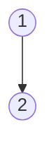
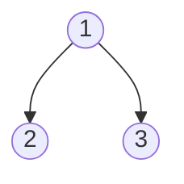
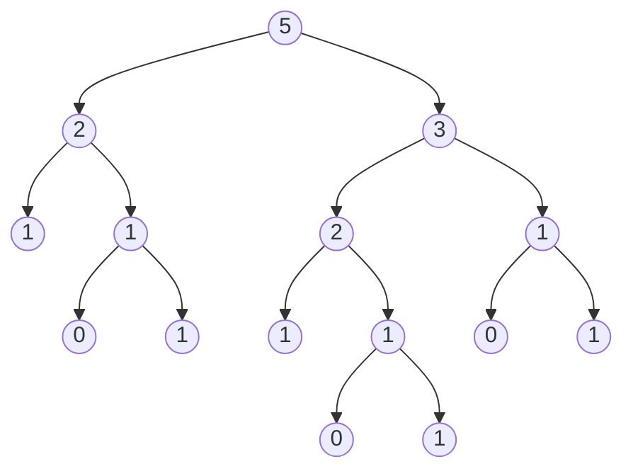

### hw_02

### Q4: Count coins

Given a positive integer `total`, a set of coins makes change for `total` if the sum of the values of the coins is `total`. Here we will use standard US Coin values: 1, 5, 10, 25 For example, the following sets make change for `15`:

- 15 1-cent coins
- 10 1-cent, 1 5-cent coins
- 5 1-cent, 2 5-cent coins
- 5 1-cent, 1 10-cent coins
- 3 5-cent coins
- 1 5-cent, 1 10-cent coin

Thus, there are 6 ways to make change for `15`. Write a recursive function `count_coins` that takes a positive integer `total` and returns the number of ways to make change for `total` using coins. Use the `next_largest_coin` function given to you to calculate the next largest coin denomination given your current coin. I.e. `next_largest_coin(5)` = `10`.

> *Hint:* Refer the [implementation](http://composingprograms.com/pages/17-recursive-functions.html#example-partitions) of `count_partitions` for an example of how to count the ways to sum up to a total with smaller parts. If you need to keep track of more than one value across recursive calls, consider writing a helper function.

```python
def next_largest_coin(coin):
    """Return the next coin. 
    >>> next_largest_coin(1)
    5
    >>> next_largest_coin(5)
    10
    >>> next_largest_coin(10)
    25
    >>> next_largest_coin(2) # Other values return None
    """
    if coin == 1:
        return 5
    elif coin == 5:
        return 10
    elif coin == 10:
        return 25

def count_coins(total):
    """Return the number of ways to make change for total using coins of value of 1, 5, 10, 25.
    >>> count_coins(15)
    6
    >>> count_coins(10)
    4
    >>> count_coins(20)
    9
    >>> count_coins(100) # How many ways to make change for a dollar?
    242
    >>> from construct_check import check
    >>> # ban iteration
    >>> check(HW_SOURCE_FILE, 'count_coins', ['While', 'For'])                                          
    True
    """
    "*** YOUR CODE HERE ***"
```

### hw_05

第一次没做出来看了答案的：

### Q5: Finding Berries!

The squirrels on campus need your help! There are a lot of trees on campus and the squirrels would like to know which ones contain berries. Define the function `berry_finder`, which takes in a tree and returns `True` if the tree contains a node with the value `'berry'` and `False` otherwise.

*Hint:* Considering using a for loop to iterate through each of the branches recursively!

```python
def berry_finder(t):
    """Returns True if t contains a node with the value 'berry' and 
    False otherwise.

    >>> scrat = tree('berry')
    >>> berry_finder(scrat)
    True
    >>> sproul = tree('roots', [tree('branch1', [tree('leaf'), tree('berry')]), tree('branch2')])
    >>> berry_finder(sproul)
    True
    >>> numbers = tree(1, [tree(2), tree(3, [tree(4), tree(5)]), tree(6, [tree(7)])])
    >>> berry_finder(numbers)
    False
    >>> t = tree(1, [tree('berry',[tree('not berry')])])
    >>> berry_finder(t)
    True
    """
    "*** YOUR CODE HERE ***"
```

Use Ok to test your code:

```python
python3 ok -q berry_finder
```

问题的关键在于不能够违反数据抽象原则，即自己写的代码总是通不过以下测试，归根结底是使用了其他selector函数，包括is_tree(),is_leaf()等等，然而能够通过测试的 代码只会使用两种最基础的selector，即：`branches()`以及`label()`，即我只需要获得它们的根节点以及树枝，其他操作均无必要：

### Q7: Don't violate the abstraction barrier!

> Note: this question has no code-writing component (if you implemented `berry_finder` and `sprout_leaves` correctly!)

When writing functions that use an ADT, we should use the constructor(s) and selector(s) whenever possible instead of assuming the ADT's implementation. Relying on a data abstraction's underlying implementation is known as *violating the abstraction barrier*, and we never want to do this!

It's possible that you passed the doctests for `berry_finder` and `sprout_leaves` even if you violated the abstraction barrier. To check whether or not you did so, run the following command:

Use Ok to test your code:

```python
python3 ok -q check_abstraction
```

The `check_abstraction` function exists only for the doctest, which swaps out the implementations of the `tree` abstraction with something else, runs the tests from the previous two parts, then restores the original abstraction.

The nature of the abstraction barrier guarantees that changing the implementation of an ADT shouldn't affect the functionality of any programs that use that ADT, as long as the constructors and selectors were used properly.

If you passed the Ok tests for the previous questions but not this one, the fix is simple! Just replace any code that violates the abstraction barrier, i.e. creating a tree with a new list object or indexing into a tree, with the appropriate constructor or selector.

Make sure that your functions pass the tests with both the first and the second implementations of the Tree ADT and that you understand why they should work for both before moving on.

## Submit

Make sure to submit this assignment by running:

```python
python3 ok --submit
```

### Q9: Riffle Shuffle

The familiar [riffle shuffle](https://fredhohman.com/card-shuffling/static/images/riffle.gif) of a deck of cards (or in our case, of a sequence of things) results in a new configuration of cards in which the top card is followed by the middle card, then by the second card, then the card after the middle, and so forth. Assuming the deck (sequence) contains an even number of cards, write a list comprehension that produces the shuffled sequence.

*Hint:* To write this as a single comprehension, you may find the expression `k%2`, which evaluates to 0 on even numbers and 1 on odd numbers, to be useful. Consider how you can use the 0 or 1 returned by `k%2` to alternatively access the beginning and the middle of the list.

```python
def riffle(deck):
    """Produces a single, perfect riffle shuffle of DECK, consisting of
    DECK[0], DECK[M], DECK[1], DECK[M+1], ... where M is position of the
    second half of the deck.  Assume that len(DECK) is even.
    >>> riffle([3, 4, 5, 6])
    [3, 5, 4, 6]
    >>> riffle(range(20))
    [0, 10, 1, 11, 2, 12, 3, 13, 4, 14, 5, 15, 6, 16, 7, 17, 8, 18, 9, 19]
    """
    "*** YOUR CODE HERE ***"
    return _______
```


Use Ok to test your code:

```python
python3 ok -q riffle
```

##### 本题最为关键的是：运用k%2来实现寻址数列中的奇数与偶数部分：

```python
def riffle(deck):
	return [deck[(i%2)*(len(deck)//2)+(i//2)] for i in range(len(deck))]
```

### Tree ADT的使用：

```python
def tree(root_label, branches=[]):
   for branch in branches:
      assert is_tree(branch), 'branches must be trees'
   return [root_label] + list(branches)

def label(tree):
        return tree[0]

def branches(tree):
        return tree[1:]

def is_leaf(tree):
        return not branches(tree)

def is_tree(tree):
        if type(tree) != list or len(tree) < 1:
            return False
        for branch in branches(tree):
            if not is_tree(branch):
                return False
        return True
```

上述接口实现了对利用嵌套列表表示树的抽象过程，也就是说，之后无论我们构建怎样的树，只能够使用函数`tree()`以及‘[]’符号，不能直接使用`[]`进行树的构建，这种行为属于对数据抽象原则的违反！

下面是几个树构建的例子：

```python
tree(1)
```


```python
tree(1,[[2]])
```




```python
tree(1,[[2],[3]])
```



```python
tree(1,[[2,[3]]])          #其实这样生成树是违反数据抽象原则的
tree(1,[tree(2,[[3]])])    #这样生成树是符合数据抽象原则的
```


常用函数：

### 遍历打印叶子节点：

```python
def print_(T):
   for i in branches(T):
      if(is_leaf(i)):
         print(i)
      else:
         print_(i)
   return None
```


### 构建斐波那契树

```python
def fib_tree(n):
        if n == 0 or n == 1:
            return tree(n)
        else:
            left, right = fib_tree(n-2), fib_tree(n-1)
            fib_n = label(left) + label(right)
            return tree(fib_n, [left, right])
```



### 数一数二叉树一共有多少个叶子节点：

```python
def count_leaves(tree):
      if is_leaf(tree):
          return 1
      else:
          branch_counts = [count_leaves(b) for b in branches(tree)]
          return sum(branch_counts)
```

### 遍历所有节点，只要有一个节点等于输入值，则输出True，否则输出False

```python
def berry_finder(t):
    """Returns True if t contains a node with the value 'berry' and
    False otherwise.

    >>> scrat = tree('berry')
    >>> berry_finder(scrat)
    True
    >>> sproul = tree('roots', [tree('branch1', [tree('leaf'), tree('berry')]), tree('branch2')])
    >>> berry_finder(sproul)
    True
    >>> numbers = tree(1, [tree(2), tree(3, [tree(4), tree(5)]), tree(6, [tree(7)])])
    >>> berry_finder(numbers)
    False
    >>> t = tree(1, [tree('berry',[tree('not berry')])])
    >>> berry_finder(t)
    True
    """
    "*** YOUR CODE HERE ***"
    if (label(t) == 'berry'):
        return True
    for i in branches(t):
        if berry_finder(i):
            return True
    return False
```

另一种解法：

```python
def berry_finder(t):
	if (label(t) == 'berry'):
		return True
    return True in [berry_finder(i)  for i in branches(t)]
```

### 老问题：

考虑整数的和分解，譬如recursion(6,4)，表示用最大加数为4的和的式子表示6，会有多少种情况？

```python
>>> print(recursion(6, 4))
4 + 2
4 + 1 + 1
3 + 3
3 + 2 + 1
3 + 1 + 1 + 1
2 + 2 + 2
2 + 2 + 1 + 1
2 + 1 + 1 + 1 + 1
1 + 1 + 1 + 1 + 1 + 1
```

解法一（递归）：

```python
def recursion(n,m):
	if (m==1 or m==0):
		return 1
	if(n-m>m):
		return recursion(n-m,m)+recursion(n,m-1)
	else:
		return recursion(n-m,n-m) +recursion(n,m-1)
```

解法二（二叉树）：

### 待完成！！！！！！！！！！！！！！！！！！！！！！！！！！！！！！！！！

### 问题：返回树中是否存在路径，路径上的条目将拼写出特定的单词。

```python
def has_path(t, word):
    """Return whether there is a path in a tree where the entries along the path
    spell out a particular word.

    >>> greetings = tree('h', [tree('i'),
    ...                        tree('e', [tree('l', [tree('l', [tree('o')])]),
    ...                                   tree('y')])])
    >>> print_tree(greetings)
    h
      i
      e
        l
          l
            o
        y
    >>> has_path(greetings, 'h')
    True
    >>> has_path(greetings, 'i')
    False
    >>> has_path(greetings, 'hi')
    True
    >>> has_path(greetings, 'hello')
    True
    >>> has_path(greetings, 'hey')
    True
    >>> has_path(greetings, 'bye')
    False
    """
    assert len(word) > 0, 'no path for empty word.'
    "*** YOUR CODE HERE ***"
    if (len(word) == 1):
        if (label(t) == word[0]):
            return True
        else:
            return False
    for i in branches(t):
        if (has_path(i, word[1:])):
            return True
    return False
```
